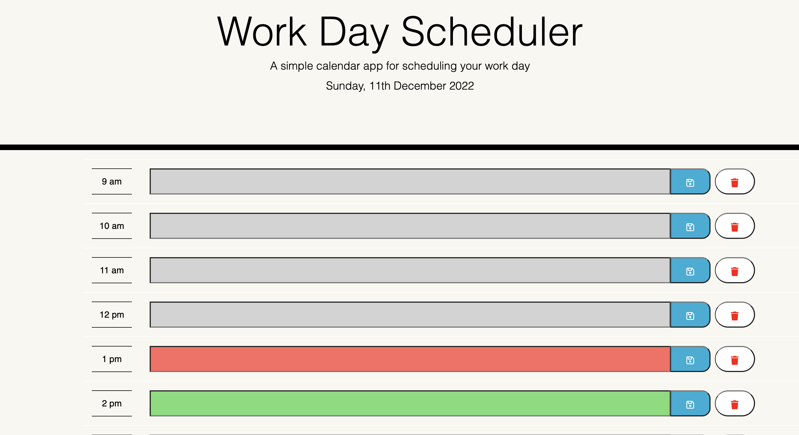

# Work-Day-Scheduler

Link to live app: https://daveym1.github.io/Work-Day-Scheduler/

## Description

A daily planner for logging tasks during the work day. Built using HTML, CSS, Javascript and jQuery. I also used a third-party API - moment.js 

## Using the App

You can log tasks for each hour of the working day by typing into the text boxes. You can save each hour's task which will store it in local storage so it remains even if the page is closed and returned to later. You can also delete individual entries.

## Moment.js

I used this third party API int the app to get the current time and date. I also used it to change the colour of the text boxes according to the current time - grey for past hours, red for present and green for future.

## Screenshot

